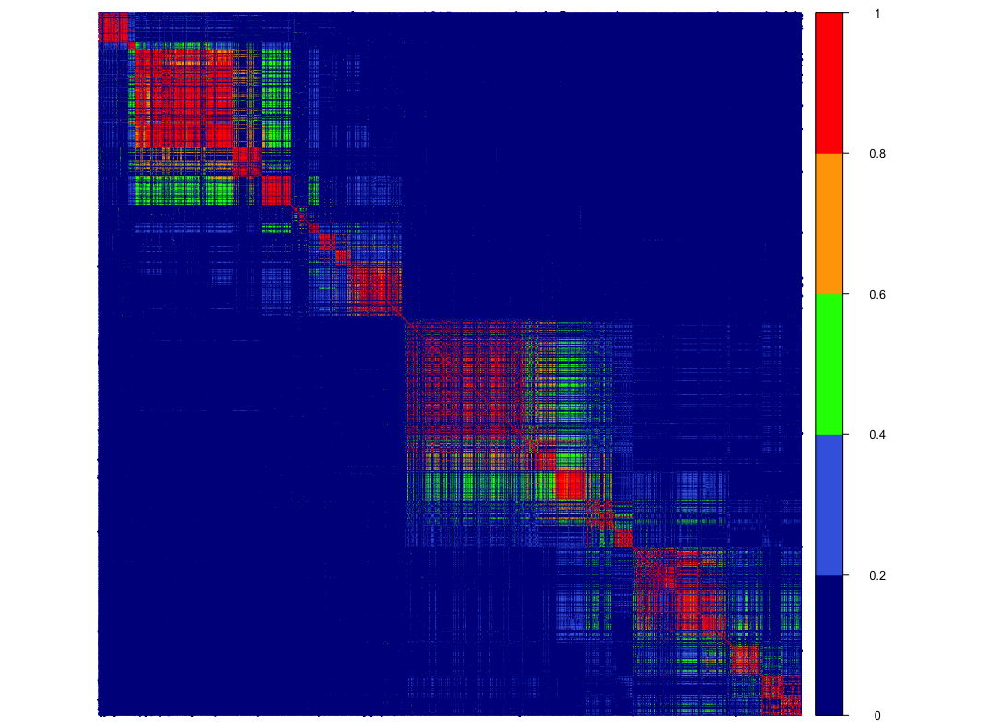

# RSPO3-eBMD example

In this application example, we showcase the utility of SharePro in assessing colocalization with the cis-pQTL of the RSPO3 locus and eBMD GWAS. 
Colocalization analysis is difficult in this locus because of a complicated LD structure and multiple causal variants.

<p align="center">
  
  <br>
  <em>Figure 1: LD matrix in the RSPO3 locus.</em>
</p>

## Data

We obtained the openly available GWAS summary statistics for heel bone mineral density from [GEFOS consortium](http://www.gefos.org). 
For GWAS summary statistics for circulating abundance of RSPO3 protein, we used the pQTL (protein quantitative trait loci) summary statistics from [the Fenland study](https://omicscience.org/apps/pgwas/).
Since both studies are conducted in the European population, LD (linkage disequalibrium) matrix was calculated using [UK Biobank](https://www.ukbiobank.ac.uk) European ancestry individuals.

```
## get eBMD GWAS summary statistics
wget http://www.gefos.org/sites/default/files/Morrisetal2018.NatGen.SumStats.tar_0.gz
tar -zvxf Morrisetal2018.NatGen.SumStats.tar_0.gz 
rm Morrisetal2018.NatGen.SumStats.tar_0.gz

## get pQTL summary statistics from https://omicscience.org/apps/pgwas/
wget https://omicscience.org/apps/pgwas/data/somamer_label.txt
jar vxf Pietzner_et_al_2021_pGWAS_11_21_2022_221142.zip

## get reference panel in the RSPO3 locus
module load plink/1.9b_6.21-x86_64
plink --bfile ~/scratch/UKB_Geno/6 --chr 6 --from-bp 127000000 --to-bp 128000000 --make-bed --out 
RSPO3_UKB
```

## Data Preprocessing

Since different colocalization methods require distinct inputs, we provide [match_bim_ss.py](match_bim_ss.py) for matching reference and alternative alleles in GWAS studies and LD calculation and formatting inputs. 

```
## prepare inputs for SharePro
python match_bim_ss.py --rss Biobank2-British-Bmd-As-C-Gwas-SumStats.txt.gz 
res_invn_X8427_118_Fenland_MA_auto_chrX_filtered_1pc.txt.gz --bim RSPO3_UKB.bim --rsID RSID rsid 
--A1 EA Allele1 --A2 NEA Allele2 --BETA BETA Effect --SE SE StdErr --save .  --prefix BMD_SH 
RSPO3_SH --N N TotalSampleSize --EAF EAF Freq1 --cols SNP Z

## prepare inputs for PWCoCo
python match_bim_ss.py --rss Biobank2-British-Bmd-As-C-Gwas-SumStats.txt.gz 
res_invn_X8427_118_Fenland_MA_auto_chrX_filtered_1pc.txt.gz --bim RSPO3_UKB.bim --rsID RSID rsid 
--A1 EA Allele1 --A2 NEA Allele2 --BETA BETA Effect --SE SE StdErr --save .  --prefix BMD_pwcoco 
RSPO3_pwcoco --N N TotalSampleSize --EAF EAF Freq1 --cols SNP A1 A2 EAF BETA SE P N --header

## calculate LD matrix
plink --bfile RSPO3_UKB --extract BMD_SH.txt --r --matrix --out RSPO3
```

After this step, we now have the required inputs for SharePro: 
* [the summary file](BMD_RSPO3.zld) 
* [formatted eBMD summary statistics](BMD_SH.txt) 
* [formatted RSPO3 pQTL summary statistics](RSPO3_SH.txt)
* [the matched LD matrix](RSPO3.ld)

## Colocalization analysis

First, we conducted colocalization analysis with [SharePro](https://github.com/zhwm/SharePro_coloc), which jointly models LD and assesses colocalization of traits while allowing for multiple causal signals.

Traditionally, colocalization is assessed using [COLOC](https://chr1swallace.github.io/coloc/) which assumes only one causal signal and do not take into account of LD between variants.

Some methods have extended the [COLOC](https://chr1swallace.github.io/coloc/) framework to allow for multiple causal signals. 
Most of them implement a two-step strategy. Namely, they first account for LD via fine-mapping or conditional analysis to identify candidate variants for colocalization analysis, separately for two traits. 
Then, for each possible pair of candidate variants, probabilities of colocalization are assessed under the one causal variant assumption. 

Here, we have included the comparison with [COLOC](https://chr1swallace.github.io/coloc/), [COLOC+SuSiE](https://doi.org/10.1371/journal.pgen.1009440), [eCAVIAR](https://www.cell.com/ajhg/fulltext/S0002-9297(16)30439-6) and [PWCoCo](https://github.com/jwr-git/pwcoco).

```
## coloc with SharePro
python ../src/sharepro_loc.py \
--zld BMD_RSPO3.zld \
--zdir . \
--N 426824 10708 \
--save . \
--prefix BMD_RSPO3_SH \
--verbose \
--K 10

## coloc with COLOC and COLOC + SuSiE
module load rstudio-server
Rscript csusie.R

## coloc with eCAVIAR
~/utils/CAVIAR-C++/eCAVIAR -o BMD_RSPO3_eCAVIAR -l RSPO3.ld -l RSPO3.ld -z BMD_SH.txt -z 
RSPO3_SH.txt

## coloc with PWCoCo
~/utils/pwcoco/build/pwcoco --bfile RSPO3_UKB --sum_stats1 BMD_pwcoco.txt --sum_stats2 
RSPO3_pwcoco.txt
```

## Result visualization

SharePro identified strong evidence of shared signals with a colocalization probability of 1.00
while other methods demonstrated a limited evidence for colocalization. We can visualize both the [locus](../doc/BMD_RSPO3.pdf) and the [colocalization results](../doc/BMD_RSPO3_H4.pdf).
```
Rscript ../doc/plot_RSPO3_BMD.R
```

## Sensitivity analysis

We also performed prior sensitivity analysis to examine the effect of prior colocalization probability on colocalization results and for this locus, the colocalization results are robust to prior settings.

```
mkdir sensitivity
cd sensitivity
for i in 1e-3 1e-4 1e-5 1e-6 1e-7; do python ../../src/sharepro_loc.py \
--zld ../BMD_RSPO3.zld \
--zdir ../ \
--N 426824 10708 \
--save $i \
--prefix BMD_RSPO3_SH \
--verbose \
--K 10 \
--sigma $i; done
```

